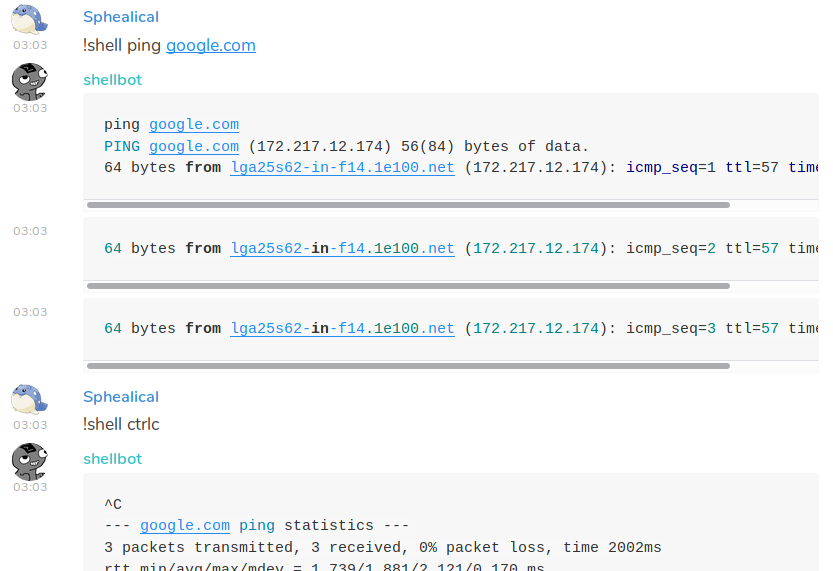

# matrix-shellbot

Matrix-shellbot connects to a Matrix (Matrix.org) server and lets users input commands to a shell session.

## Requirements
- Python v3.6
- matrix_client
- click

`pip install -r requirements.txt`

## Usage

`$ python3 main.py --help`

Note: environment variables can be used for all options. SHELLBOT\_USERNAME, SHELLBOT\_PASSWORD, SHELLBOT\_HOMESERVER, etc.
